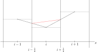
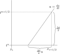

Advection routine
=================

Following the notation in [BK19]_, the quantities of interest that we are advecting are

.. math::
    \Psi = (\chi, \chi \vec{u}, \chi w, \chi^\prime)
    
under the advective fluxes $(P \vec{v})$. Say we are doing the advection for the full time-step update, i.e. the quantities $(P \vec{v})^{n+1/2}$ and $\Psi^n$ are available, where $n$ indexes the time-level.

Consider (21) in [BK19]_ for the cells $i-1$, $i$ and $i+1$,

.. math::
    \mathcal{A}^{\Delta t / 2}_{x} \mathcal{U}_i = \mathcal{U}_i - \frac{\Delta t}{2 \Delta x} \left[ (Pu)^{n+1/2}_{i+1/2} \Psi_{i+1/2} - (Pu)^{n+1/2}_{i-1/2} \Psi_{i-1/2} \right],
    :label: advect_split_step
    
where, corresponding to the :py:class:`management.variable.Vars` data container,

.. math::
    \mathcal{U}_i := \left\{ \rho, \rho \vec{u}, \rho w, P, P \chi^\prime \right\}_i.
..     :label: advect_u_container
    
We see that :eq:`advect_split_step` is a half time-step update,

.. math::
    \mathcal{A}^{\Delta t / 2}_{x} \mathcal{U}_i = \mathcal{U}_i - \frac{1}{\Delta x} \left[ \int_{t}^{t+\frac{\Delta t}{2}} \mathcal{F}(\mathcal{U}_i, \mathcal{U_{i+1}}) - \mathcal{F}(\mathcal{U}_{i-1},\mathcal{U}_i) ~ dt \right],
..     :label: advect_hts_update
    
where $\mathcal{F}(\cdot,\cdot)$ is the flux across the cell interface for the respective quantity $\mathcal{U}$. This is from a second-order `MUSCL scheme <https://en.wikipedia.org/wiki/MUSCL_scheme>`_. For a general advection equation,

.. math::
    \mathcal{U}_t + \mathcal{F}_x(\mathcal{U}) = 0,
    
and discretising the above yields

.. math::
    \frac{\mathcal{U}^{n+1} - \mathcal{U}^n}{\Delta t} = - \frac{1}{\Delta x} \left[ \mathcal{F}(\mathcal{U}_{i+1/2}) - \mathcal{F}(\mathcal{U}_{i-1/2})\right],
    
where the right-hand side is a central difference scheme evaluated at the cell edges. Rewriting this,

.. math::
    \mathcal{U}^{n+1} = \mathcal{U}^n - \frac{\Delta t}{\Delta x} \left[ \mathcal{F}(\mathcal{U}_{i+1/2}) - \mathcal{F}(\mathcal{U})_{i-1/2} \right],
    :label: time_update_U
    
we identify the first term in the square bracket on the right with $(P u)^{n+1/2}_{i+1/2} \Psi_{i+1/2}$ and the second with $(P u)^{n+1/2}_{i-1/2} \Psi_{i-1/2}$. Recall that the advective fluxes $(P u)^{n+1/2}$ are available at the onset of the full time-stepping. A cell-to-face averaging is done to obtain these values at $i+1/2$ and $i-1/2$. The missing pieces are then $\Psi^{n+1/2}_{i-1/2}$ and $\Psi^{n+1/2}_{i+1/2}$.

.. todo::
    Link or insert `numerical_fluxes.recompute_advective_fluxes` here.
    
To obtain second-order accuracy in space for the solution, we use a slope limiter to approximate the cell-averages instead of the piecewise constants cell-averages in a first-order `Godunov's method <https://en.wikipedia.org/wiki/Godunov%27s_scheme>`_. This sets up a `Riemann problem <https://en.wikipedia.org/wiki/Riemann_problem>`_ that is solved by a `HLLE solver <https://en.wikipedia.org/wiki/Riemann_solver#HLLE_solver>`_.

Reconstruction
--------------

.. _fig_slope_recovery:

    
    Recovering the slope limiter for the $i$-th cell.

Let's get the missing pieces, say $\Psi^{n+1/2}_{i+1/2}$. First, apply the slope limiter. :numref:`Figure %s <fig_slope_recovery>` shows a simple case where the slope in the $i$-th cell is the average of the slopes constructed from the cell averages (dotted-lines) of the adjacent cells. This is done in :py:meth:`physics.gas_dynamics.recovery.slopes` while :py:meth:`physics.gas_dynamics.recovery.limiters` is a switch for the limiter choice specified in the initial coonditions. The limited slope of the $i$-th cell is denoted $S_i$. Now,

.. math:: 
    \Psi(t^{n+1/2}, x_{i+1/2}) = \Psi(t^n, x_{i+1/2} - \frac{\Delta t}{2} u)
    :label: backward_characteristic
    
by tracing the characteristic of $\Psi$ backwards in time. :numref:`Figure %s <fig_backward_tracing>` illustrates this.

.. _fig_backward_tracing:

    
    Backward tracing of the characteristic from $(t^{n+1/2}, x_{i+1/2})$.
    
$u$ is the velocity at the cell face $i+1/2$, with

.. math::
    u_{i+1/2} = \frac{(P u)^{n+1/2}_{i+1/2}}{(P_i + P_{i+1})/2},
    
as $u$ is a constant along the characteristic at $x_{i+1/2}$.

As we now have the limited slope in the cell, the value for $\Psi$ anywhere in the cell can be obtained by linear interpolation,

.. math::
    \Psi_i(t^n, x) = \Psi_i^n + (x - x^n_i) S_i^n.
    :label: linear_interpolation
    
Plugging :eq:`linear_interpolation` into :eq:`backward_characteristic`,

.. math::
    \Psi(t^{n+1/2}, x_{i+1/2})  &= \Psi^n_i + \left( x_{i+1/2}^n - \frac{\Delta t}{2} u - x^n_i \right) S^n_i \\
                                &= \Psi^n_i + \frac{\Delta x}{2} \left( 1 - \frac{\Delta t}{\Delta x} u \right) S^n_i \\
                                &=: \Psi^-_{i+1/2},
    :label: left_solution
                                
where $x_{i+1/2} - x_{i} = \Delta x /2$ is used. $\Psi^-_{i+1/2}$ is the solution of $\Psi$ from the left for the cell interface at $i+1/2$. See :numref:`figure %s <fig_discontinuity_at_cell_interface>` for more details.

The Riemann problem
-------------------

.. _fig_discontinuity_at_cell_interface:
.. figure:: ./_static/discontinuity_at_cell_interface.svg
    :width: 60%
    
    Discontinuity at the cell interface $i+1/2$ arising from the recovery of $\Psi_{i+1/2}^{n+1/2}$.

:eq:`left_solution` supposes that the characteristic for $\Psi^{n+1/2}_{i+1/2}$ is traced from the $i$-th cell. Another possibility is from the $(i+1)$-th cell,

.. math::
    \Psi (t^{n+1/2}, x_{i+1/2}) &= \Psi^n_{i+1} - \frac{\Delta x}{2} \left( 1 + \frac{\Delta t}{\Delta x} u \right) S^n_{i+1} \\
                                &=: \Psi^{+}_{i+1/2}.
    :label: right_solution
    
:eq:`time_update_U`, :eq:`left_solution` and :eq:`right_solution` constitute the Riemann problem. :eq:`left_solution` and :eq:`right_solution` are computed in :py:meth:`physics.gas_dynamics.recovery.recovery`.

HLLE Solver
-----------

The Riemann problem is solved by selecting the choice of :eq:`left_solution` or :eq:`right_solution` based on the direction of the flux,

.. math:: 
    \Psi_{i+1/2} = \sigma \Psi^{-}_{i+1/2} + (1-\sigma) \Psi^+_{i+1/2},
    :label: hlle_step_1
    
where

.. math::
    \sigma = \text{sign}\left[ (Pu)^{n+1/2}_{i+1/2} \right].
    :label: hlle_step_2
    
:eq:`hlle_step_1` and :eq:`hlle_step_2` are computed in :py:meth:`physics.gas_dynamics.numerical_flux.hll_solver`. With :eq:`hlle_step_1`, :eq:`time_update_U` is updated, yielding the solution to :eq:`advect_split_step`.
                                
Strang splitting
----------------

:eq:`advect_split_step` demonstrates the solution of a substep obtained from the `Strang splitting <https://en.wikipedia.org/wiki/Strang_splitting>`_ in the advection scheme. Writing the advection in the full time-stepping of $\mathcal{U}^*$ as a general operator,

.. math::
    \mathcal{U}^{**} = \mathcal{A}_{\text{full}}^{\Delta t} ~ \mathcal{U}^*,
    
where $\mathcal{A}_{\text{full}}^{\Delta t}$ is the advection operator. Splitting the operator dimension-wise,

.. math::
    \mathcal{U}^{**} = \mathcal{A}_{x}^{\Delta t/2} \mathcal{A}_{y}^{\Delta t/2} \mathcal{A}_{z}^{\Delta t/2} \mathcal{A}_{z}^{\Delta t/2} \mathcal{A}_{y}^{\Delta t/2} \mathcal{A}_{x}^{\Delta t/2} \mathcal{U}^*,
    
recalling that the Strang splitting is a second-order operator splitting method. The Strang-splitting is computed in :py:meth:`physics.gas_dynamics.explicit.advect` which calls :py:meth:`physics.gas_dynamics.explicit.explicit_step_and_flux` for each substep.

More details on the methods discussed here can be found in [LeVeque]_. 

    
    

References
----------

.. [BK19] Benacchio, T., and R. Klein, 2019: A semi-implicit compressible model for atmospheric flows with seamless access to soundproof and hydro-static dynamics. *Monthly Weather Review*, **147** (**11**), 4221–4240.

.. [LeVeque] LeVeque, R.J., 1992: Numerical methods for conservation laws. Basel: Birkhäuser.
