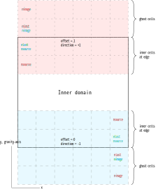

.. _boundary_handling:

Boundary handling
=================
Boundary handling for the ghosts cells (:class:`discretization.kgrid.ElemSpaceDiscr`) and nodes (:class:`discretization.kgrid.NodeSpaceDiscr`) are handled in ``boundary.py``.

Cell boundarys are handled by the function :func:`inputs.boundary.set_explicit_boundary_data`. The bondary conditions are given in the initial user data file, :py:attr:`inputs.user_data.UserDataInit.bdry_type`.

For ghost cells in directions without gravity, the ghost cells are padded by the ``np.pad()`` function.

For ghost cells in direction with gravity, the update follows :ref:`fig_1`, where the blue and red sets of `nlast`, `nimage`, and `nsource` are used together in an update step depending on the values of `offset` and `direction`.

.. _fig_1:

    Figure 1: Boundary handling of gravity axis.
    

Todos
-----
* get_ghost_padding
* set_ghost_cells
* set_ghost_nodes