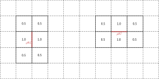

Compute advecting flux
======================

Advecting fluxes :math:`P\vec{u} = \rho \theta \vec{u}` and :math:`P\vec{v} = \rho \theta \vec{v}` are computed on the cell faces.

A six-cells stencil is used with weights given in :numref:`figure %s <fig_1>`.

First the values of :math:`\rho \theta \vec{u}` and :math:`\rho \theta \vec{v}` are calculated in each cell. Then, since the values along the faces are calculated for all grid cells, this is equivalent to a convolution of the six-cells stencil across the entire grid with the appropriate weights kernel. This is achieved by the :func:`scipy.signal.convolve2d` function.

Note that since the convolution uses cell-centered values to calculate values along cell-faces, the output array is one index value smaller than the input array.

.. _fig_2:

    Stencil with weights used to calculate the advecting fluxes along the cell faces.
    
